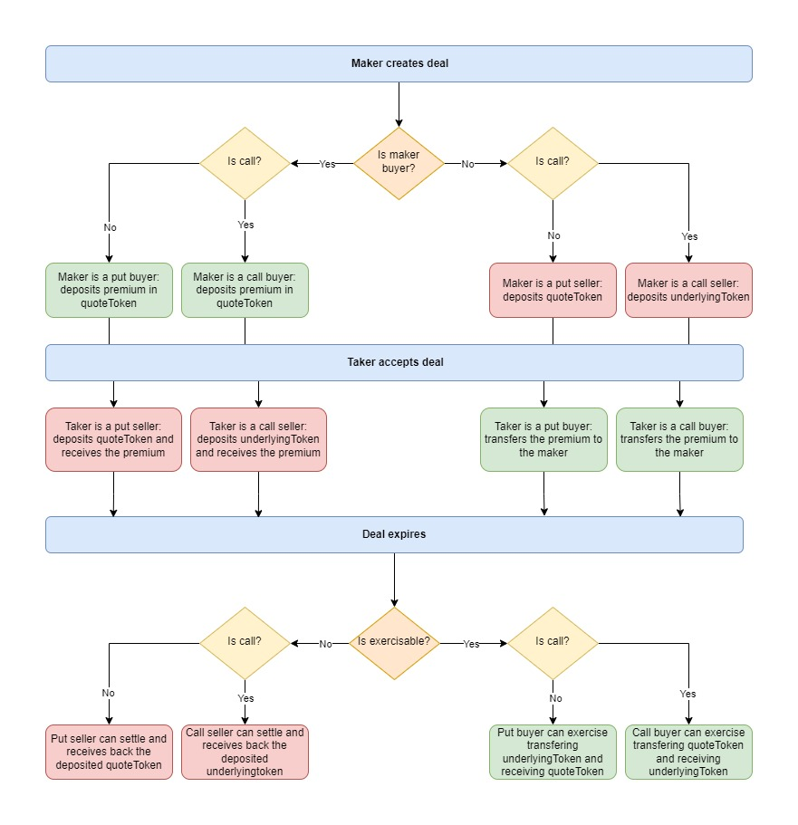

# OTC SWAP PROTOCOL

## Summary
### The problem your project addresses

**Our primary goal is to add a layer of easiness to embark new users into web3 with PayPal integration.**

Our vision is to revolutionize the web3 experience by seamlessly infusing it with an unparalleled level of simplicity and user-friendliness. We are confident that by integrating features akin to widely-used platforms such as PayPal, we can significantly boosts user adoption. Retailers need a swift and uncomplicated gateway to the web3 infrastructure, but the multitude of transactions required in web3 for sending money globally can pose challenges.

By enabling retailers to make simple payments using PayPal - a platform they are already familiar with - alongside having only a Metamask wallet, we create a straightforward pathway for them to purchase their preferred tokens. This convergence of traditional payment methods and blockchain technology is our way of bridging the gap between the existing retail market and the burgeoning world of web3.


### How you’ve addressed the problem

Technically we implemented the call to ChainkLink Functions to perform offchaink payment using PayPal. Once the offchain transaction is verified by ChainkLink Functions the smart contract performs a swap and send money to buyer using ChainkLink functions.

Alongside we built the OTC Swap protocol with small innovation - the user can swap tokens without depositing them into smart contract but only approving them.

The fundamental idea is to allow on-chain peer-to-peer trading of ERC-20 tokens without using an exchange, allowing whales exit liquidity without impacting charts. This will allow them to trade their big sizes, avoiding sandwich attacks on DEX. Another advantage is to create an on-chain market for exotic products - here: options on altcoins - that are usually traded OTC, thus avoiding counterparty risk and/or the need for a 3rd party.

### Which technologies you used to do so

We used Foundry, Solidity, React, NextJs, Chakra UI, ChainLink.

**We used ChainLink for**:
- price feeds
- ChainLink functions to perform offchain payments

## Documentation

### PayPal integration description

##### Definitions:
A meta txn is an EIP-712 signed message.
Relayer refers to an entity (usually a server or service) that broadcasts transactions to the Ethereum network on behalf of the user. This service facilitates the interaction between the Ethereum network and off-chain systems, such as the PayPal payment system.

##### Process:

User A wants to perform a swap (ie. buy altcoin) using PayPal account and create a payment order. The maker B had made his/her PayPal account known to smart contract while creating RFS.

User A is requested to sign a meta-transaction (EIP-712 signed message) is initiated where a relayer (a third-party service) conducts the transaction on behalf of the user A. The relayer invokes a function via Chainlink that sends the JS source code to call Paypal's API to verify if the payment has been approved. If the payment is indeed authorized, it's then captured.

After the payment is successfully captured, the relayer triggers a transaction to transfer the desired tokens from the OtcNexus protocol to User A's account. Note that these tokens must be pre-deposited within the contract.

Following the successful token transfer, a final payment is issued to User B via PayPal, again utilizing Chainlink's functions. The ultimate aim is to create a seamless experience for the user to purchase tokens directly with their PayPal account from a smart contract.

The flow can be schematized as follow:

User A pays with Paypal => Sign EIP-712 meta-txn => It gets sent to the relayer => Relayer perform the txn calling chainlink functions with Paypal API => First payment order is settled => On the callback the swap is performed (user gets his token) => Final payment is made using Paypal API and seller gets his money

### Definitions

- OTC: out of the counter. It is a trading activity that happens peer-to-peer without involving an exchange.
- RFS: request for swap. It is an offer to swap a x amount of token0 for y amount of token1. In our context we may swap for fiat money using PayPal. RFS can accept multiple tokens as payment for token offered
- Maker: the address that creates the RFS, and wants to swap x token0 for y token1.
- Taker: the address that fills the RFS, and wants to swap y token1 for x token0.
- Swap: fill partially or completely RFS

### Use case documentation

User connects his/ her wallet. The user can:
- create request for swap (RFS) by offering amount0 of token0 (token offered)
  - user can either approve tokens offered to swap or deposit them to smart contract
  - user can ask fixed amount of another single token. That way it is just an offer to swap a x amount of token0 for y amount of token1 (fixed amount type)
  - user can accept token1, token2 ... etc. at their current price with discount / premium (dynamic RFS type)
  - user can accept token1, token2 ... etc. at their current price but fix the price of offered tokens in USD (fixed USD RFS type)
  - user can accept payments in fiat via PayPal
- swap - ie. fill RFS

Therefore we have the following RFS types. In this context Listed Altcoins are altcoins whose price feeds are available by ChainLink Oracles; non-listed altcoins - whose price feeds are not:

|                                      | Allow Multiple (>1) | Allow Non-listed altcoins | Allow Listed Altcoins |
|--------------------------------------|---------------------|---------------------------|-----------------------|
| Dynamic RFS- Token Offered           | No                  | No                        | Yes                   |
| Dynamic RFS - Token(s) Accepted      | Yes                 | No                        | Yes                   |
| Fixed USD RFS - Token Offered        | No                  | Yes                       | Yes                   |
| Fixed USD RFS - Token(s) Accepted    | Yes                 | Yes                       | Yes                   |
| Fixed Amount RFS - Token Offered     | No                  | Yes                       | Yes                   |
| Fixed Amount RFS - Token(s) Accepted | No                  | Yes                       | Yes                   |

## OTC Option

The OtcOption contract allows to trade OTC options with physical delivery.

### Definitions

- Option: a financial derivative that gives the buyer the right, but not the obligation, to buy or sell an asset at a specified price within a certain period.
- Put Option: a type of option that gives the buyer the right to sell an asset at a specified price within a specific timeframe.
- Call Option: a type of option that gives the buyer the right to buy an asset at a specified price within a specific timeframe.
- Deal: equivalent of a RFS for options.
- Maker: the address that creates a deal. The maker will determine all the deal parameters
- Taker: the address that accepts a deal and will be the counterparty of the maker.
- Underlying token: base token to exchange.
- Quote token: token that is used to price the underlying token.
- Strike: the predetermined price at which an option can be exercised, either to buy (call option) or sell (put option).
- Maturity: time after which the deal expires and can be settled.
- Premium: amount of quote token that the buyer is willing to pay for the option.

### Process

- A maker creates a new deal. Depending on the option type and whether the maker is a buyer or seller (side), the maker will deposit a certain amount of underlying token or quote token.
- A taker decides to accept the deal. Depending on the option type and side, the taker deposit a certain amount of underlying token or quote token.
- The deal expires.
- The Chainlink pricefeed is used to determine whether the deal is in the money (ITM) or out of the money (OTM). In particular:
  - The deal is in the money if it is a call and the current price is above the strike price, or if it is a put and the current price is below the strike price.
  - The deal is out of the money otherwise.
- Three cases can happen:
  - The deal is exercisable (ITM) and the buyer can settle it.
  - The deal is not exercisable (OTM) and the seller can settle it.
  - 24 hours have passed since the maturity date time, and the deal is removed. This feature is used to allow the seller to recover their margin in case the option is ITM but the buyer never exercised it.

### Flowchart



## Developer's guide


### Prerequisites
Current setup used:
```
forge 0.2.0
solc 0.8.17+commit.8df45f5f.Darwin.appleclang
Node.js 16.14.2
npm 8.15.0
yarn 1.22.19
```

### Installation
Clone the repository:
```
https://github.com/NindoK/otc_swap_protocol.git
cd otc_swap_protocol
```

### Run on L2 Mumbai Polygon Testnet
Please prepare MetaMask wallet. Please use chain id 80001 and rpc url https://matic-mumbai.chainstacklabs.com/

Note - for L2 deployment you don't need to install forge, anvil, cast.
Contracts are deployed on L2. Please refer to chain id 80001 in the following file:

```html
https://github.com/NindoK/otc_swap_protocol/blob/main/frontend/constants/networkMapping.json
```

Run on L2:
```
(cd ./frontend) && npm install && npm run dev
```

### Run on local chain


Install dependencies:

```
forge install
```

Now in `lib/` all the required packages should be available.

ENV file - run the following for root directory, `frontend` and `chainlink_functions_environment/relayer`:
```
mv .env.example .env
```

To run tests:

```
forge test
```

To check code coverage:

```
forge coverage
```

| File                               | % Lines           | % Statements     | % Branches       | % Funcs         |
|------------------------------------|-------------------|------------------|------------------|-----------------|
| script/DeployLocal.sol             | 0.00% (0/13)      | 0.00% (0/17)     | 100.00% (0/0)    | 0.00% (0/1)     |
| src/OtcMath.sol                    | 100.00% (4/4)     | 100.00% (4/4)    | 100.00% (2/2)    | 100.00% (2/2)   |
| src/OtcNexus.sol                   | 75.21% (88/117)   | 66.46% (105/158) | 57.95% (51/88)   | 71.43% (15/21)  |
| src/OtcOption.sol                  | 100.00% (103/103) | 97.06% (132/136) | 94.44% (68/72)   | 100.00% (17/17) |
| src/OtcToken.sol                   | 100.00% (1/1)     | 100.00% (1/1)    | 100.00% (0/0)    | 100.00% (1/1)   |
| test/MockToken.sol                 | 100.00% (2/2)     | 100.00% (2/2)    | 100.00% (0/0)    | 100.00% (2/2)   |
| test/helpers/OtcNexusTestSetup.sol | 0.00% (0/86)      | 0.00% (0/95)     | 100.00% (0/0)    | 0.00% (0/8)     |
| Total                              | 60.74% (198/326)  | 59.08% (244/413) | 74.69% (121/162) | 71.15% (37/52)  |

**Run local chain:**
```
anvil
```
Export private key from anvil's addresses listed in console out and then save it in .env file:
```
PRIVATE_KEY=0x4d9x...cdc912
```
Then run in terminal:
```
source .env
```

Deploy smart contracts for the first time:
```
forge script ./script/DeployLocal.sol:DeployLocal --fork-url http://localhost:8545 --broadcast
```
Deploy smart contracts - later runs:
```
forge script ./script/DeployLocal.sol:DeployLocal --fork-url http://localhost:8545 --broadcast --resume
```
After deployment two directories will be created:
- /out -> where you have ABIs to your smart contracts
- /broadcast/DeployLocal.sol/31337/run-latest.json -> where you can confirm the address on which your smart contract is deployed

Verify you have interactions with smart contract - assuming OtcNexus is deployed on address `0x9fE46736679d2D9a65F0992F2272dE9f3c7fa6e0`:
```
cast call 0x9fE46736679d2D9a65F0992F2272dE9f3c7fa6e0 "rfsIdCounter()"
0x0000000000000000000000000000000000000000000000000000000000000001
```
Verify the contract's address in chain id 31337 matches the one deployed by commandline:

```html
https://github.com/NindoK/otc_swap_protocol/blob/main/frontend/constants/networkMapping.json
```

Run frontend:
```
cd ./frontend
npm install
npm run dev
```

Connect wallet with network:
- rpc url: http://localhost:8545
- chain id: 31337

### Troubleshoot wallet problems
- metamask => settings => advanced => Clear activity tab data
- restart anvil
- redeploy forge script
- rerun frontend

### Paypal setup

To be able to perform the Paypal transactions using the relayer first install the dependencies:

```
cd chainlink_functions_environment/relayer && yarn
```

Create the `.env`file and populate the variables:

```
mv .env.example .env
```

From the root project run with anvil a local node by making sure to deploy only the `ReceiverStable.sol`:

```
cd ../../ && anvil
```

And run in another terminal:

```
forge script ./script/DeployLocal.sol:DeployLocal --fork-url http://localhost:8545 --broadcast
```

Now that the relayer is up and running, we just need to start our backend by using:

```
cd chainlink_functions_environment/relayer && yarn start
```

Now we can sign EIP712 messages and the batches are sent to the relayer.

#### Frontend
To be able to make Paypal transaction we need to set the environment variables to pass the `CLIENT_ID` and `CLIENT_SECRET` for Paypal:

```
cd frontend && mv .env.example .env
```

Populate the respective field and the app is ready to go.

#### Chainlink functions simulation

Due to lack of time and technological problems we weren't able to provide a flow that was able to perform everything in one transaction, thus we had to split everything in small steps.

##### Paypal capture order

After the user have made a payment from the frontend, we can capture that payment running the `paypal_approve_payment.js` script inside the chainlink nodes by using `npx hardhat functions-simulate`.

Make sure that the following line is uncommented:

```
source: fs.readFileSync("./paypal_approve_payment.js").toString(),
```

And fill the order_id found in the console of the frontend:
```
args: [$ORDER_ID_TO_BE_FILLED],
```

##### Perform the swap

To perform the swap and send the tokens from the contract to the taker, first be sure to have filled all the correct data in the `.env` file.

Then run the following command, where `$RFS_ID` should be an integer referring to the id of the RFS:

```
node makePaypalSwap.js $RFS_ID
```

##### Paypal paying the seller

After the swap have been performed, the only thing left is to pay the seller by sending the script `paypal_send_money.js` to the chainlink nodes.

Make sure that the following line is uncommented:

```
source: fs.readFileSync("./paypal_send_money.js").toString(),
```

And fill `$PAYPAL_EMAIL`, `$AMOUNT`, `$CURRENCY` which are, respectively, the paypal email of the seller, the amount he should be payed and the currency used.

```
args: [$PAYPAL_EMAIL, $AMOUNT, $CURRENCY],
```
